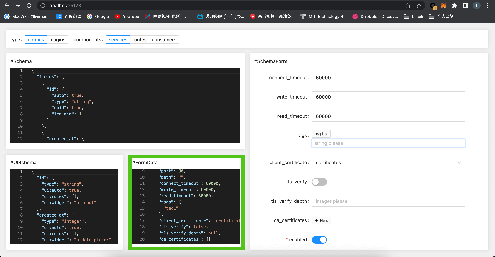

# Schema 2 From

:clock5: Working time 11.12 17:00  - 11.13 21:30 :collision: 22 hours :collision:

## Preview

## Description

### Five modules

#### 1. QueryForm

> User can click the radios to request for the schemas of entities or plugins

#### 2. Schema

> Display the schema from the service.
> User can modified the schema by the monaco editor, and it will change the data of UISchema, FormData and SchemaForm.

#### 3. UISchema

> Provide the basic data of UI to generate the SchemaForm.

#### 4. FormData

> The model of the SchemaForm.

#### 5. SchemaForm

> Schema visualization form. The form model is bind to the the data of FormData.

## Preretirement

- [x] [Install Docker](https://docs.docker.com/desktop/install/mac-install/)
- [x] [Install Kong Gateway on Docker](https://docs.konghq.com/gateway/3.0.x/install/docker/)
  - Kong Dashboard http://localhost:8002/
  - Kong Admin Api http://localhost:8001/
- [x] Install Node.js version 16.0 or higher

## Start
Node.js 16+
- [x] npm install
- [x] npm run dev

## Dependencies
- [x] [Vue3](https://cn.vuejs.org/guide/quick-start.html)
- [x] [Ant Desgin Vue](https://www.antdv.com/components/form)
- [x] [Monaco Editor](https://github.com/microsoft/monaco-editor)

## References
- [react-jsonschema-form](https://github.com/rjsf-team/react-jsonschema-form)
